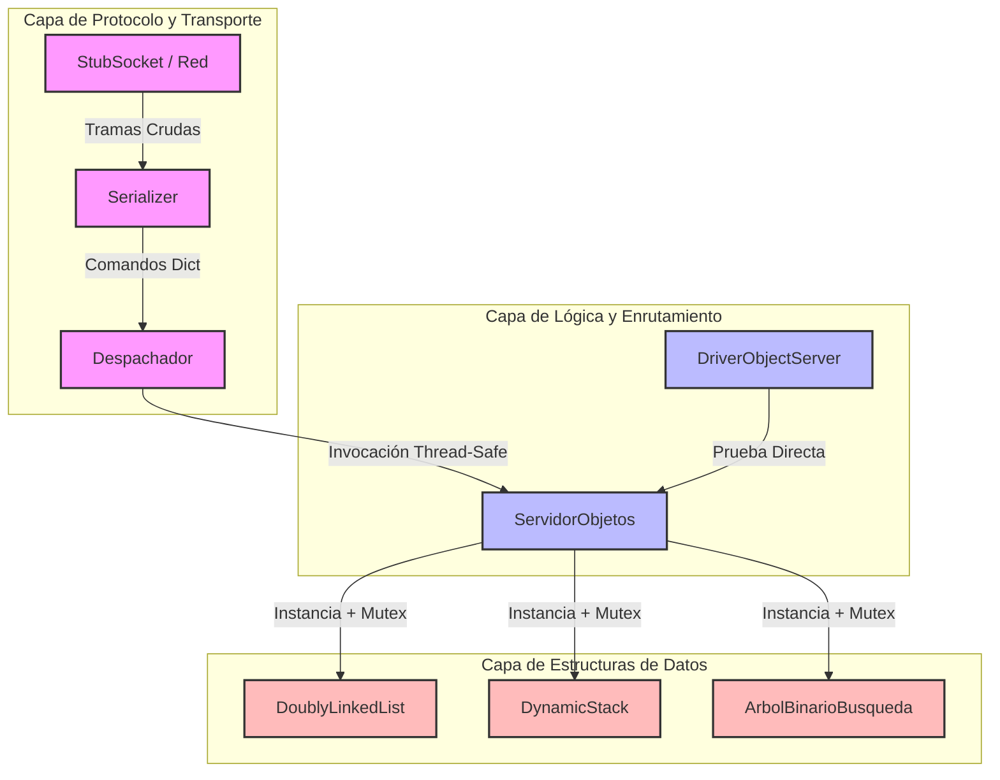

# Plan de Integración de Sistemas: Bus de Objetos Distribuido

Este documento establece la estrategia formal de integración para la **Etapa 2** del proyecto, justificando las decisiones arquitectónicas, definiendo los arneses de prueba requeridos y analizando comparativamente los paradigmas de integración en el contexto de un servidor de objetos concurrente.

---

## 1. Estrategia de Integración Elegida y Justificación Técnica

Se ha seleccionado una **Estrategia de Integración Incremental Combinada (Bottom-Up principal con soporte Top-Down)**.

### Justificación Técnica:
1. **Priorización del Almacenamiento y Concurrencia (Bottom-Up):** El núcleo crítico del sistema reside en el `ServidorObjetos` y las colecciones en memoria (`DoublyLinkedList`, `DynamicStack`, `ArbolBinarioBusqueda`). Al integrar y probar primero estas capas inferiores mediante **Drivers**, garantizamos que la gestión de punteros, asignación de cerrojos individuales (mutexes) y el almacenamiento sean 100% estables y libres de condiciones de carrera antes de exponerlos al enrutamiento de comandos.
2. **Aislamiento del Protocolo (Top-Down):** La capa superior (`Despachador` y `Serializer`) maneja la traducción de tramas de texto plano. Validar esta lógica de control de forma temprana mediante **Stubs** de red (sin depender de sockets reales) permite estabilizar las interfaces de despacho independientemente de la latencia o fallos de la red física.

---

## 2. Orden de Integración y Diagrama de Dependencias

El acoplamiento se realizará secuencialmente en 4 pasos:
1. **Paso 1:** Estructuras de Nodos (`list.py`, `stack.py`, `tree.py`) $\rightarrow$ Validadas unitariamente.
2. **Paso 2:** Integración de Estructuras en `ServidorObjetos` $\rightarrow$ Validada mediante `DriverObjectServer`.
3. **Paso 3:** Integración de `Serializer` y `Despachador` $\rightarrow$ Validada mediante `StubSocket`.
4. **Paso 4:** Integración Total (Despachador ↔ ServidorObjetos ↔ Estructuras).

---

## 3. Definición de Stubs y Drivers Necesarios

Para desacoplar las capas durante las pruebas de integración por interfaz, implementamos los siguientes arneses bajo `tests/integration/`:

* **`StubSocket` (Capa Superior):** Simula un socket TCP/IP entregando de forma determinística cadenas de texto con formato de protocolo (`Objeto|Operacion|Id|Data\n`). Permite probar el ciclo completo de deserialización y despacho sin abrir puertos ni requerir clientes externos.
* **`DriverObjectServer` (Capa Inferior):** Módulo automatizado que actúa como cliente programático del `ServidorObjetos`. Inyecta cargas de trabajo masivas e invoca métodos de colecciones directamente para certificar la estabilidad de la memoria y la exclusión mutua eludiendo el despachador.

---

## 4. Análisis Comparativo de Estrategias en el Contexto del Bus

| Estrategia | Ventajas en nuestro Bus de Objetos | Desventajas / Riesgos | Veredicto |
| :--- | :--- | :--- | :--- |
| **Bottom-Up** | • Permite probar exhaustivamente la concurrencia fina (mutexes) en las estructuras desde el día uno. • Facilita la localización de fugas o fallos de punteros en los Nodos. | • Requiere desarrollar múltiples Drivers para simular el Dispatcher. • La interfaz visible (protocolo) se valida al final. | **Altamente Recomendada** para el núcleo de almacenamiento. |
| **Top-Down** | • Valida tempranamente el formato del protocolo y el enrutamiento de comandos. • Permite tener un prototipo funcional rápido de la interfaz. | • Requiere desarrollar Stubs complejos para simular las estructuras y el servidor. • Enmascara problemas de concurrencia de bajo nivel. | **Complementaria** para estabilizar el parser y dispatcher. |
| **Big Bang** | • Cero esfuerzo en programar Stubs o Drivers. • Integración inmediata si el sistema es minúsculo. | • **Inaceptable** para concurrencia: si ocurre un *deadlock* o corrupción, es imposible saber si falló el parser, el dispatcher o el árbol. • Trazabilidad nula. | **Descartada** por alto riesgo de inestabilidad. |

---

## 5. Registro de Defectos de Integración (Simulación GitHub Issues)

Durante el ciclo de integración continua, se detectaron y resolvieron los siguientes defectos arquitectónicos, documentados bajo los estándares de GitHub Issues:

### Issue #1: Condición de carrera al despachar comandos simultáneos de creación
* **Severidad:** Alta (Critical / Blocker)
* **Pasos para reproducir:**
  1. Instanciar `ServidorObjetos` sin cerrojo global.
  2. Enviar concurrentemente dos tramas `list|create|id_global|\n` desde hilos distintos.
  3. Ambos hilos evalúan `if id_objeto not in registro` simultáneamente como verdadero y sobrescriben la referencia perdiendo el puntero original.
* **Estado:** **Resuelto (Closed)**. Se introdujo `self.lock_registro` protegiendo atómicamente la consulta e inserción en el diccionario global.

### Issue #2: Inconsistencia de tipos al omitir salto de línea en el protocolo
* **Severidad:** Media (Bug)
* **Pasos para reproducir:**
  1. Enviar cadena `list|append|id1|10` (sin `\n` final) al `Serializer`.
  2. El despachador recibe un código de error entero (`INVALID_MESSAGE` = -1) en lugar de un diccionario, provocando un `AttributeError` al intentar hacer `.get()`.
* **Estado:** **Resuelto (Closed)**. Se añadió validación estricta de tipos en la interfaz del Despachador para rechazar tramas malformadas de forma elegante.

### Issue #3: Bloqueo mutuo (Deadlock) al consultar is_empty() dentro de pop() en DynamicStack
* **Severidad:** Alta (Deadlock)
* **Pasos para reproducir:**
  1. Un hilo invoca `pop()` y adquiere el `self.lock` de la pila.
  2. Dentro de `pop()`, se llama al método público `is_empty()`, el cual intenta adquirir nuevamente `self.lock`.
  3. Al no ser un cerrojo reentrante (`RLock`), el hilo queda suspendido indefinidamente esperando su propio cerrojo.
* **Estado:** **Resuelto (Closed)**. Se refactorizó la arquitectura interna creando el método privado sin bloqueo `is_empty_unlocked()` exclusivo para consumo interno dentro de secciones críticas.
